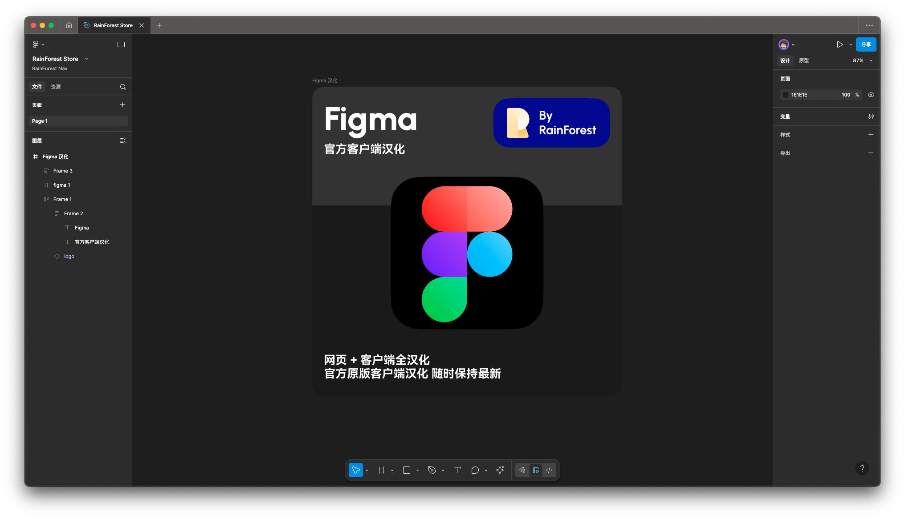
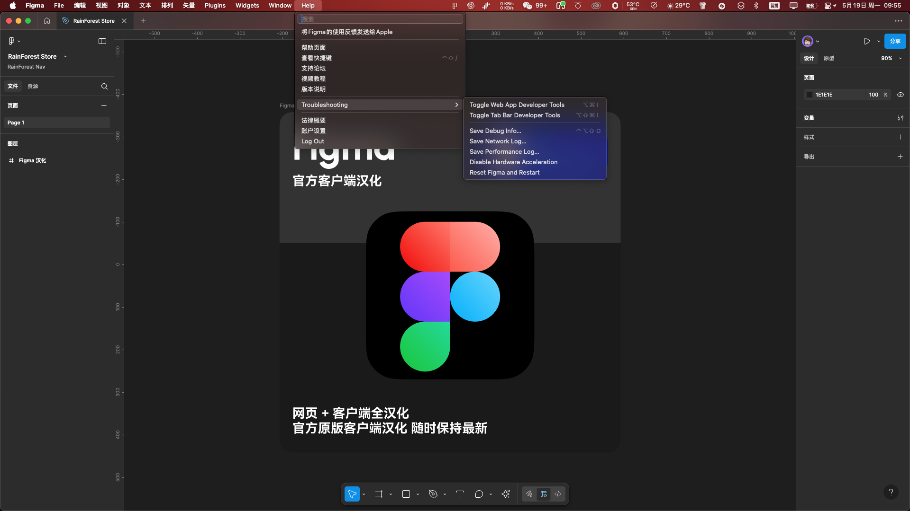

# figma-zh-CN-localized
## Figma 原生汉化项目

这个项目提取了 Figma 官方的 英文 语言包，然后使用 ChatGPT 对其进行了翻译。
目的是为了能够让原生的 Figma 应用程序支持中文，获得原生中文体验。

#### 汉化效果
因为是直接替换网络请求实现汉化，所以部署成功后，受影响的所有 Figma客户端&网页端 都会得到汉化。
如果你有比较高级的路由器，可以使用这个规则来实现整个局域网内的汉化。非常适合小团队使用，但需要一定的网络配置知识。
没有技术基础的小伙伴也不用担心，可以咨询 chatGPT 等AI对话工具协助，这个项目所有的一切都是借助了AI实现的。

### 使用方法说明
需要使用网络工具拦截并重定向语言包请求，才能实现汉化。
目前汉化正在进行中，暂时不提供具体的使用方法，敬请期待。
#### 替换规则 最推荐 Surge：
- 类型: http 307
- 正则表达式: ```https:\/\/www\.figma\.com\/webpack-artifacts\/assets\/figma_app(?:_beta)?-[a-f0-9]+\.min\.en\.json(?:\.br)?```
- 替换地址: ```https://kailous.github.io/figma-zh-CN-localized/lang/zh.json```

#### 自制工具 mitm-injector
mitm-injector 是一个基于 Python 的 MITM 注入工具，它可以拦截并重定向网络请求。
你可以使用它来实现对 Figma 语言包的重定向，从而实现汉化。
这是我自己写的一个工具，你可以在 [mitm-injector](mitm-injector/README.md) 中找到它的使用方法。
mitm-injector 支持 Surge、Shadowrocket、Clash 等代理软件作为上游代理，你可以根据自己的需求选择使用。
mitm-injector 支持在 macOS 操作系统上运行。没有 Win 设备，所以没法调试。实际上这个是跨屏太的，有win设备的小伙伴愿意折腾的话，可以尝试让AI转换一下sh脚本。
#### 注意事项
- 拦截和重定向的工具可以选择任意你喜欢的工具，只要能够拦截并重定向请求即可。
- 你需要自己签名证书，否则会被浏览器拦截。
- 如果你都操作对了，但是就是汉化没有生效，那么可能是缓存的问题，清理掉缓存即可。

### 具体不同软件的配置教程
- [Surge](help/Surge/README.md)
- 其他软件暂时没有，请先自行搜索，整体的配置逻辑可以参考Surge的配置。

----

## 加入我们
如果你有兴趣参与到这个项目中，可以联系我，我会提供具体的汉化工作流程。
相关的工作流程请参考 [工作流程](help/Developer/README.md)。
