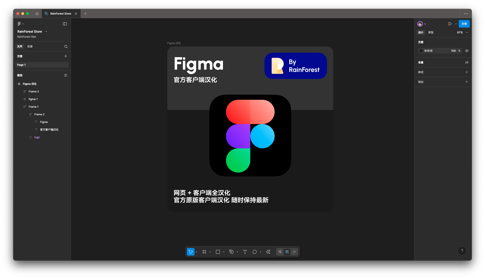

# figma-zh-CN-localized
## Figma 原生汉化项目

这个项目提取了 Figma 官方的英文语言包，然后使用 AI 对其进行了翻译。
目的是为了能够让原生的 Figma 应用程序支持中文，获得原生中文体验。

#### 汉化效果
因为是直接替换网络请求实现汉化，所以部署成功后，受影响的所有 Figma客户端&网页端 都会得到汉化。
如果你有比较高级的路由器，可以使用这个规则来实现整个局域网内的汉化。非常适合小团队使用，但需要一定的网络配置知识。

### 使用方法说明
需要使用网络工具拦截并重定向语言包请求，才能实现汉化。

#### 替换规则 最推荐 Surge：
- 类型: http 307
- 正则表达式: ```https:\/\/www\.figma\.com\/webpack-artifacts\/assets\/figma_app(?:_beta)?-[a-f0-9]+\.min\.en\.json(?:\.br)?```
- 替换地址: ```https://kailous.github.io/figma-zh-CN-localized/lang/zh.json```

#### 自制工具 Figcn
Figcn 是一个基于 mitmproxy 的 MITM 注入工具，你可以在 [Figcn](https://github.com/kailous/FigCN) 中下载并使用。

---

## 项目结构

```
├── _agent/
│   ├── skills/figma_localize/      # AI 全自动汉化 Skill（脚本 + 术语表）
│   └── workflows/localize.md       # /localize 一键工作流
├── lang/                           # 核心语言包数据
│   ├── zh.json                     # 中文翻译包（主文件）
│   ├── en_latest.json              # 最新英文包（CI 自动更新）
│   └── backup/                     # 合并前自动备份
├── .github/workflows/              # CI 自动检测 Figma 更新
├── UserScript/                     # 油猴脚本（备选方案）
└── help/                           # 配置教程
```

## 汉化工作流

本项目使用 **AI Skill 自动化**完成语言包的持续同步：

1. **检测更新**：CI 每 30 分钟自动检测 Figma 官方语言包变化
2. **下载同步**：自动下载并提交最新英文包到 `lang/en_latest.json`
3. **AI 翻译**：使用 `/localize` 命令一键完成差异提取 + AI 翻译 + 合并校验

---

## 加入我们
如果你有兴趣参与到这个项目中，可以联系我。
相关的工作流程请参考 [工作流程](help/Developer/README.md)。
