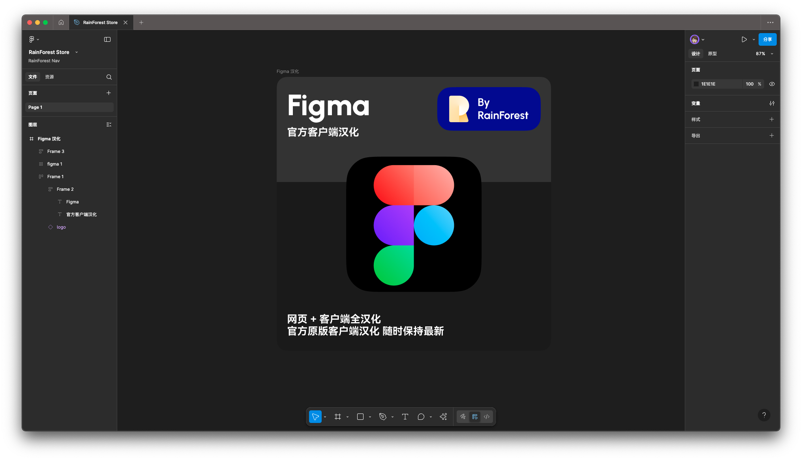

# figma-zh-CN-localized

Figma 原生中文语言包。

项目的核心产物只有一个稳定地址：

```text
https://kailous.github.io/figma-zh-CN-localized/lang/zh.json
```

只要把 Figma 官方英文语言包请求重定向到这个地址，Figma 客户端和网页端就会加载中文语言包。

## 使用方式

推荐用 Surge、Clash、Quantumult X、mitmproxy 或网关设备做 HTTP 307 重定向。

Surge 规则示例：

```text
类型: http 307
正则: https:\/\/www\.figma\.com\/webpack-artifacts\/assets\/figma_app(?:_beta|__rspack)?-[a-f0-9]+\.min\.en\.json(?:\.br)?
替换: https://kailous.github.io/figma-zh-CN-localized/lang/zh.json
```

也可以使用自制工具 [FigCN](https://github.com/kailous/FigCN)。

## 目录说明

```text
lang/
  zh.json             # 公开发布的中文语言包，路径保持稳定
  en_latest.json      # 最近一次同步的 Figma 英文包
  en_latest.json.br   # 最近一次同步的英文源包副本

_agent/
  skills/figma_localize/
    SKILL.md          # Agent 维护规则、术语表和质量要求
    agents/           # Codex Skill 列表和触发提示元数据
    scripts/          # 同步、对比、校验、合并工具
  workflows/
    localize.md       # Agent 更新工作流

help/                 # 使用配置教程
UserScript/           # 旧版用户脚本方案
```

## 更新方式

本项目现在按 Agent-first 方式维护。日常更新不需要人工整理语言包，只需要让 Agent 执行本地工具链。

常用命令：

```bash
# 使用根目录最近下载的 figma_app*.min.en.json.br(.json) 更新英文包
python3 _agent/skills/figma_localize/scripts/run_all.py

# 指定本地下载包
python3 _agent/skills/figma_localize/scripts/run_all.py --source figma_app-xxxx.min.en.json.br.json

# 使用 Skill 从已登录的 Figma 团队首页源码发现 URL 后直接同步
python3 _agent/skills/figma_localize/scripts/run_all.py --source 'https://www.figma.com/webpack-artifacts/assets/figma_app-xxxx.min.en.json.br'

# 强制尝试远程探测下载
python3 _agent/skills/figma_localize/scripts/run_all.py --remote
```

如果 `translate.py` 提示有待翻译字段，Agent 应读取 `.cache/pending.json`，按 `_agent/skills/figma_localize/SKILL.md` 的术语表生成 `.cache/translated.json`，然后运行：

```bash
python3 _agent/skills/figma_localize/scripts/validate_translation.py
python3 _agent/skills/figma_localize/scripts/run_all.py --skip-sync --skip-translate
```

上线前至少确认：

```bash
python3 _agent/skills/figma_localize/scripts/verify.py
python3 -m json.tool lang/zh.json > /dev/null
```

## 发布约束

- `lang/zh.json` 是唯一公开中文包路径，不要改名或移动。
- 根目录下载的 `figma_app*.min.en.json.br` / `.br.json` 是临时输入，不提交。
- `.cache/` 和 `lang/backup/` 是运行产物，不提交。
- Figma、FigJam、Slides、Weave、Riff、MCP、Code Connect 等产品名和技术名按 Agent 术语表处理。

## 贡献

欢迎直接提交翻译质量改进、工具链修复或配置教程更新。语言包更新优先通过 `_agent/skills/figma_localize/scripts/` 完成，避免手工编辑大 JSON。
