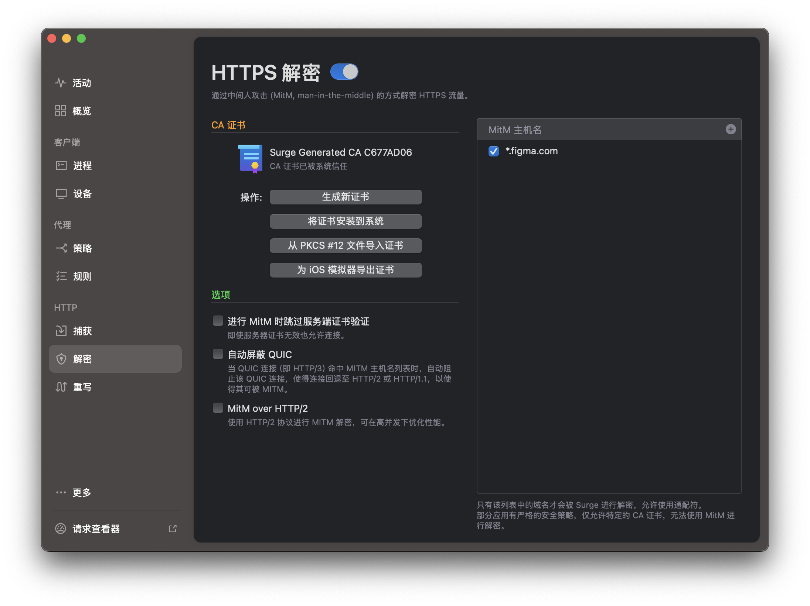
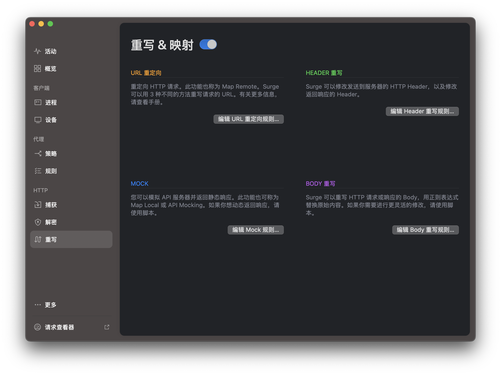
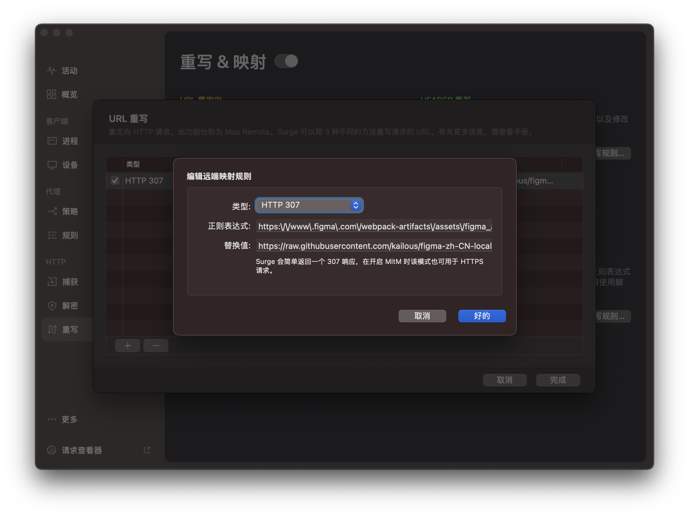
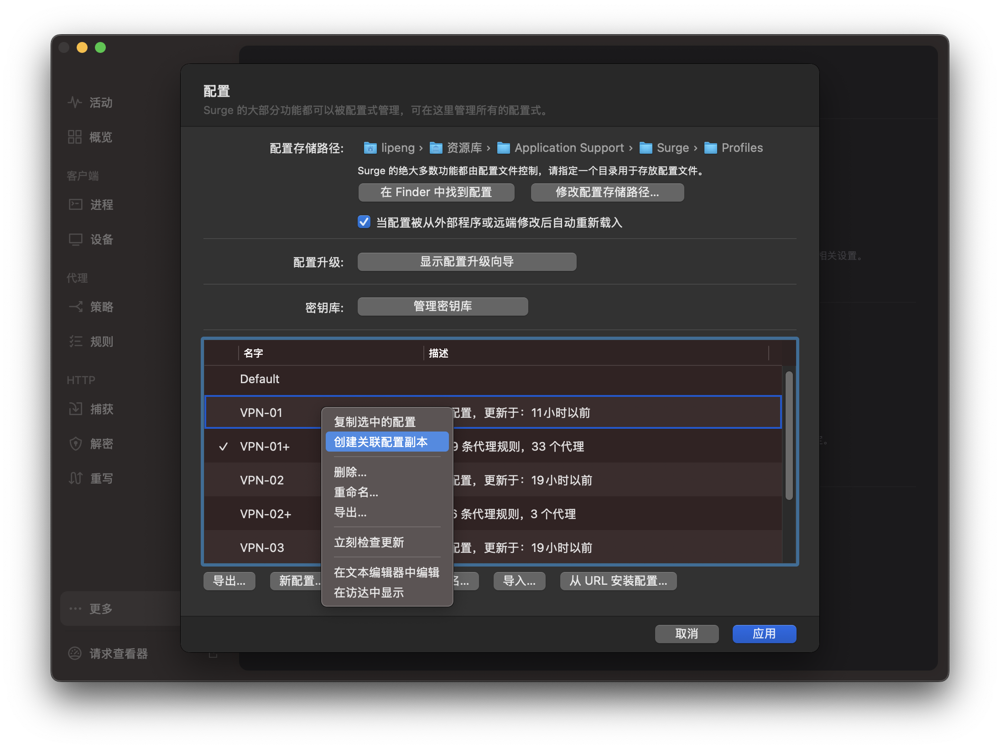

# figma-zh-CN-localized
## Figma 原生汉化项目

这个项目提取了 Figma 官方的 英文 语言包，然后使用 ChatGPT 对其进行了翻译。
目的是为了能够让原生的 Figma 应用程序支持中文，获得原生中文体验。

### 使用方法说明
需要使用网络工具拦截并重定向语言包请求，才能实现汉化。
目前汉化正在进行中，暂时不提供具体的使用方法，敬请期待。
#### 替换规则：
- 类型: http 307
- 正则表达式: ```https:\/\/www\.figma\.com\/webpack-artifacts\/assets\/figma_app_beta-[a-f0-9]+\.min\.en\.json\.br ``` 和 ```https:\/\/www\.figma\.com\/webpack-artifacts\/assets\/figma_app-[a-f0-9]+\.min\.en\.json```
- 替换地址: ```https://raw.githubusercontent.com/kailous/figma-zh-CN-localized/refs/heads/main/lang/zh/zh.json ```

#### 注意事项
- 拦截和重定向的工具可以选择任意你喜欢的工具，只要能够拦截并重定向请求即可。
- 你需要自己签名证书，否则会被浏览器拦截。

### Surge 使用案例
1. 首先需要安装证书，设置好MitM主机名，然后创建证书并信任。参考下图：
2. 然后创建规则：
3. 如果你使用订阅的代理配置，那么你的配置文件是只读的，你需要创建关联配置，这样订阅和替换都可以生效，使用关联配置后，你的配置文件就可以编辑了。

### 汉化伙伴招募
如果你有兴趣参与到这个项目中，可以联系我，我会提供具体的汉化工作流程。
我使用了python对语言包进行了排序和分割据，这样方便投递到 chatgpt 进行翻译。
你只需要将分割好的语言包发送到 chatgpt 进行翻译，然后将翻译好的结果粘贴到zh/split 目录对应的文件中即可，最终我会使用脚本将其合并成一个完整的语言包。

后续我会再增加词条对比功能，以及其他的辅助脚本，方便进行汉化工作。
目前需要招募的人员职能包括：
- 将分隔后的语言包发送到 chatgpt 进行翻译的小伙伴
- 测试体验对汉化结果进行反馈和润色的小伙伴
如果你有兴趣参与到这个项目中，可以联系我，我会提供具体的汉化工作流程。

### 汉化进度 100%
- 213/213 词条完成
### 计划
- 下载日文词条对比 未进行
- 汉化教程编写 未进行


## 开发者说明 （尚未完善，可用但需要自己摸索。）
### 对比工具使用方法
```
python tools/compare_keys.py --zh-file ./lang/zh/zh.json --en-file ./lang/zh/en.json --log compare_result.log 
```