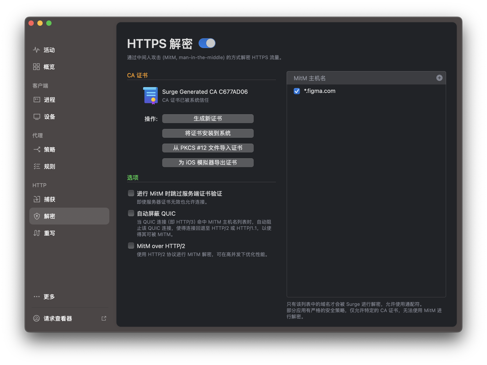
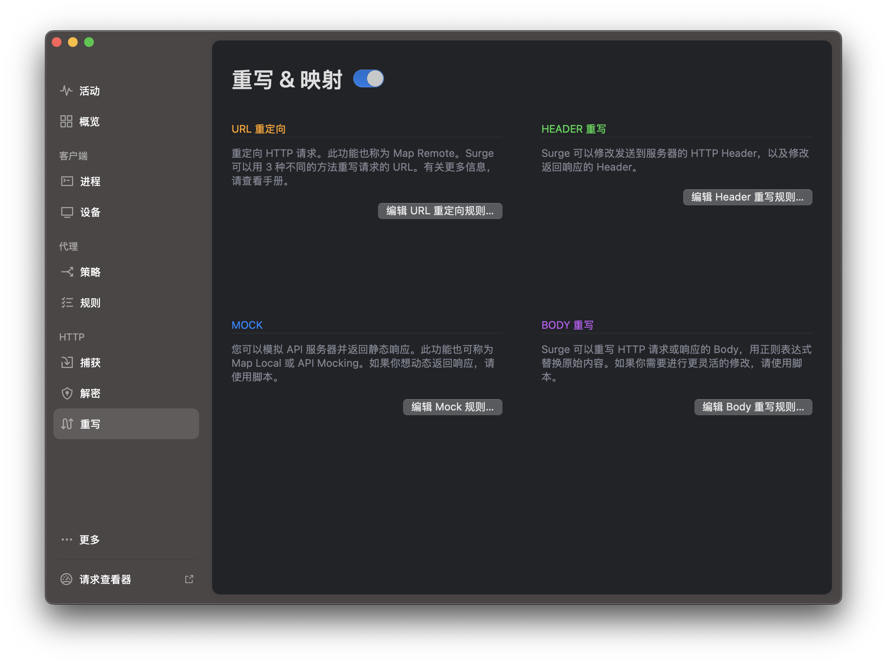
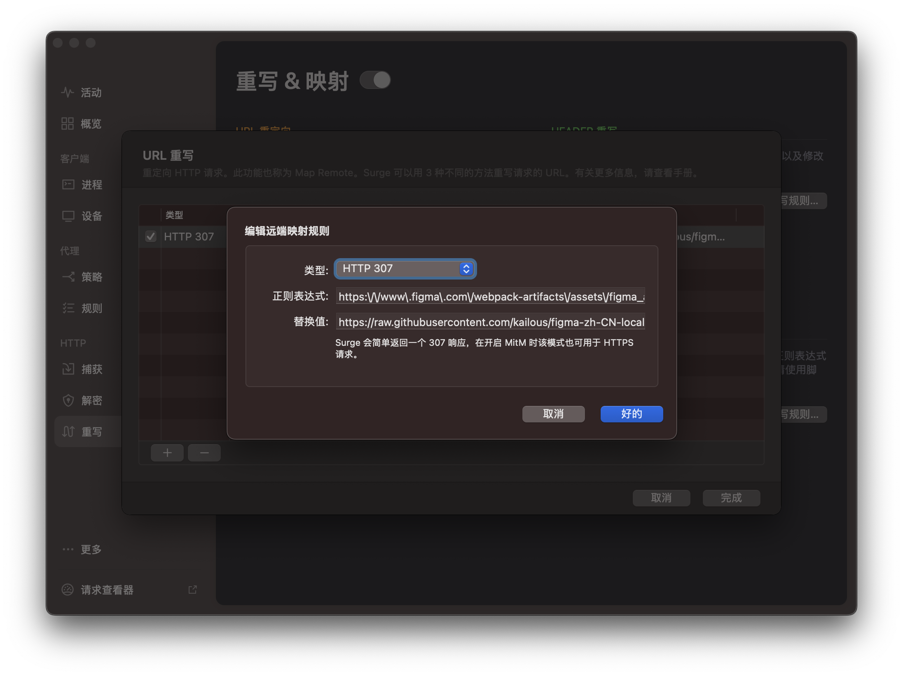
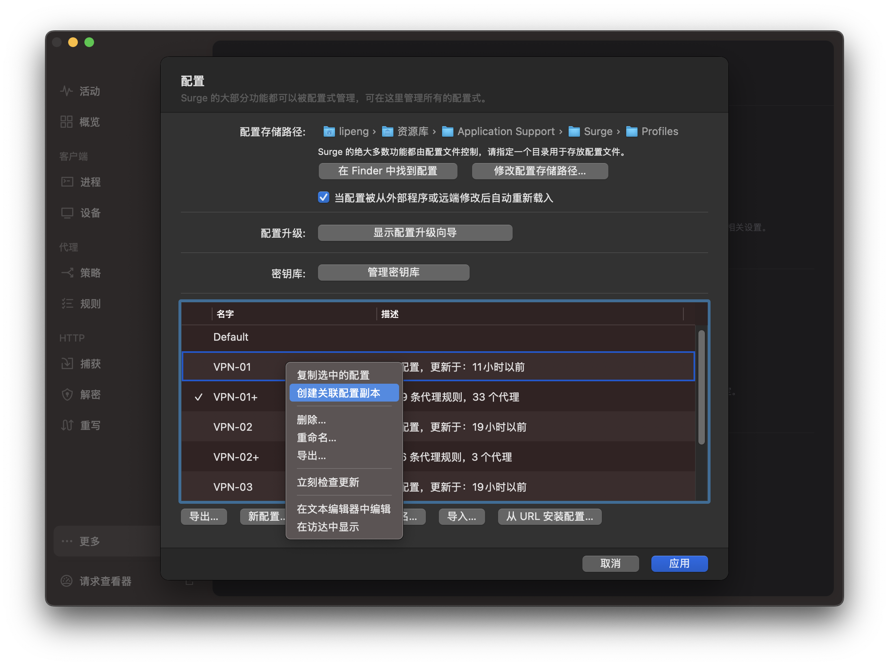

# 使用 Surge 汉化的实现方法

1. 下载并安装 Surge 软件，并付费解锁。`不提供破解版下载和相关渠道，需要请自行获取，请谅解。`
2. 首先需要安装证书，设置好MitM主机名为`*.figma.com`，然后创建证书并信任。参考下图：
3. 然后创建规则：
4. 如果你使用订阅的代理配置，那么你的配置文件是只读的，你需要创建关联配置，这样订阅和替换都可以生效，使用关联配置后，你的配置文件就可以编辑了。